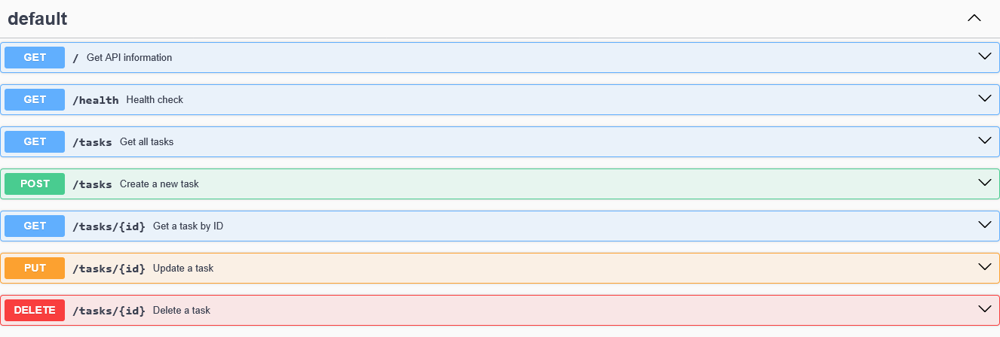

# Task API 

### What This Is
This is a lightweight, in-memory REST API built with Node.js and Express. It provides standard CRUD (Create, Read, Update, Delete) operations for managing a task list, includes a basic health-check endpoint, and serves interactive OpenAPI 3.0 documentation via Swagger UI. 

| Method | Endpoint | Description |
| :--- | :--- | :--- |
| `GET` | `/` | Retrieves basic API metadata and version details. |
| `GET` | `/health` | Returns the health status of the service. |
| `GET` | `/tasks` | Retrieves a list of all existing tasks. |
| `POST` | `/tasks` | Creates a new task (requires a JSON body with a `title`). |
| `GET` | `/tasks/:id` | Retrieves a specific task by its numeric ID. |
| `PUT` | `/tasks/:id` | Updates a specific task's `title` or `done` status. |
| `DELETE` | `/tasks/:id` | Deletes a task by its numeric ID. |
| `GET` | `/docs` | Opens the interactive Swagger UI documentation. |

### How to Install & Run
Ensure you have Node.js installed, save your server code as `app.js` then run this command:

```bash
node app.js
```

### Example Request (curl -i)
Here is an example of fetching the health check endpoint to verify the API is returning the correct headers and JSON payload.

```bash
curl -i http://localhost:3000/health

TP/1.1 200 OK
X-Powered-By: Express
Content-Type: application/json; charset=utf-8
Content-Length: 15
ETag: W/"f-VaSQ4oDUiZblZNAEkkN+sX+q3Sg"
Date: Wed, 29 Jul 2026 11:53:15 GMT
Connection: keep-alive
Keep-Alive: timeout=5

{"status":"ok"}
```

### Swagger Documentation
You can interact with and test all API endpoints directly from your browser by navigating to http://localhost:3000/docs.

