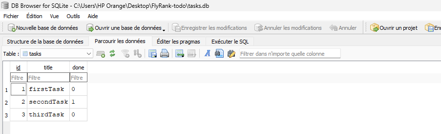
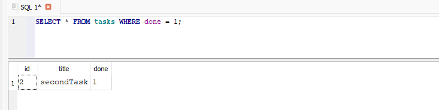

# Task API 

### What This Is
This is a lightweight, in-memory REST API built with Node.js and Express. It provides standard CRUD (Create, Read, Update, Delete) operations for managing a task list, includes a basic health-check endpoint, and serves interactive OpenAPI 3.0 documentation via Swagger UI. 

| Method | Endpoint | Description |
| :--- | :--- | :--- |
| `GET` | `/` | Retrieves basic API metadata and version details. |
| `GET` | `/health` | Returns the health status of the service. |
| `GET` | `/tasks` | Retrieves a list of all existing tasks. |
| `POST` | `/tasks` | Creates a new task (requires a JSON body with a `title`). |
| `GET` | `/tasks/:id` | Retrieves a specific task by its numeric ID. |
| `PUT` | `/tasks/:id` | Updates a specific task's `title` or `done` status. |
| `DELETE` | `/tasks/:id` | Deletes a task by its numeric ID. |
| `GET` | `/docs` | Opens the interactive Swagger UI documentation. |

### How to Install & Run
Ensure you have Node.js installed, save your server code as `app.js` then run this command:

```bash
node app.js
```

### Example Request (curl -i)
Here is an example of fetching the health check endpoint to verify the API is returning the correct headers and JSON payload.

```bash
curl -i http://localhost:3000/health

TP/1.1 200 OK
X-Powered-By: Express
Content-Type: application/json; charset=utf-8
Content-Length: 15
ETag: W/"f-VaSQ4oDUiZblZNAEkkN+sX+q3Sg"
Date: Wed, 29 Jul 2026 11:53:15 GMT
Connection: keep-alive
Keep-Alive: timeout=5

{"status":"ok"}
```

### Swagger Documentation
You can interact with and test all API endpoints directly from your browser by navigating to http://localhost:3000/docs.


### Database Architecture
This project uses **SQLite** for data persistence. 
* **Why SQLite:** It was chosen because it requires zero background services or setup, stores the entire database in a single file, and ensures task data survives server restarts.
* **File Location:** The database lives in a `tasks.db` file in the root directory. It is created automatically when the server first runs. This file is typically added to `.gitignore` so that every new clone of the repository starts with a fresh database.

Here is a view of the database :



**Example SQL Query (Stage 4):**
Here is an example of a query used to fetch a task that is marked as done / complete:
```sql
SELECT * FROM tasks WHERE done = 1;
``` 



### AI vs. ME
This version of the app was generated by AI, using the following the prompt :
```markdown
Act as an experienced software engineer. Your task is to build a basic Todo List / Task Management API using **Node.js**, **Express**, and **better-sqlite3**.

### Database Requirements
1. Create a table named `tasks` with the following schema:
   - `id`: Primary key, auto-generated
   - `title`: Text, `NOT NULL`
   - `done`: Bit (0 or 1)
   - `created_at`: Timestamp
   - `updated_at`: Timestamp
2. **Database Seeding:** On application startup, check if the `tasks` table is empty. If it is, seed it with 3 random tasks.

### API Endpoints

| Method | Endpoint | Description & Requirements |
| :--- | :--- | :--- |
| `GET` | `/` | Retrieves basic API metadata and version details. |
| `GET` | `/health` | Returns the health status of the service. |
| `GET` | `/tasks` | Retrieves a list of all existing tasks. |
| `POST` | `/tasks` | Creates a new task. `title` must not be null, and `done` must be initialized to `false` (`0`). Returns `201` on success, or `400` for a bad request. |
| `GET` | `/tasks/:id` | Retrieves a specific task by its numeric ID. Returns `201` when found, or `404` if not found. |
| `PUT` | `/tasks/:id` | Updates a specific task's `title` or `done` status. If a field is omitted, retain its previous value. Returns `201` when updated, or `400` if `title` is null. |
| `DELETE` | `/tasks/:id` | Deletes a task by its numeric ID. |
```

#### Key Differences
1. **`db.transaction` vs. Sequential `.run()`**: For a small app like this with non-critical data, using sequential `.run()` calls shouldn't be an issue. However, given my love for good practices, I think using `db.transaction` is better—if a single row insertion fails, the whole seeding process is aborted, leaving a clean slate for a retry.
2. **Updating a Task (`PUT /tasks/:id`)**: The AI handled the logic for the `done` status better than I did.
3. **Filtering**: This one is on me, as I didn't mention adding filtering in my prompt.